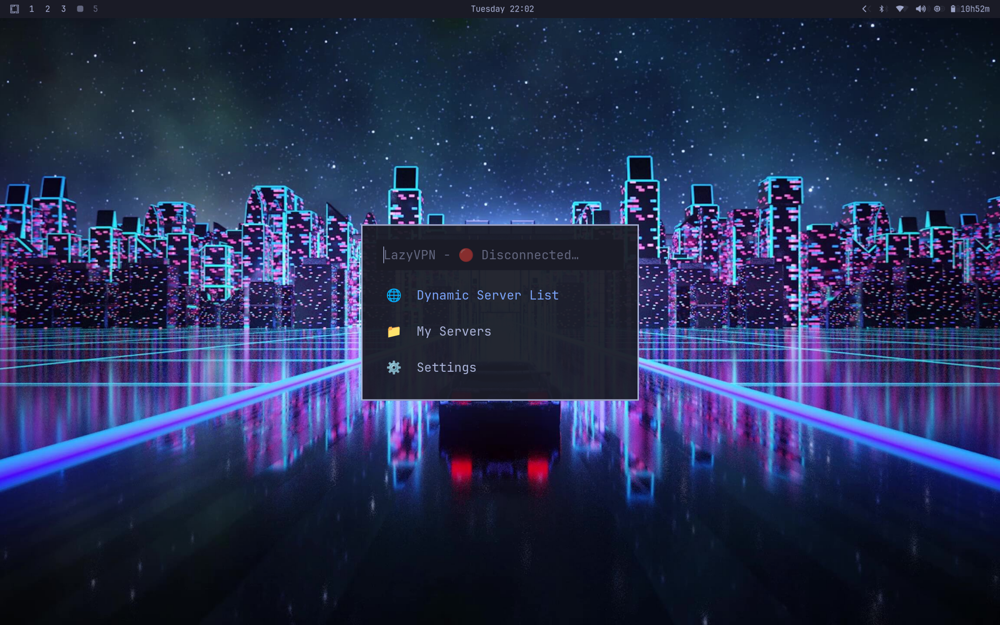
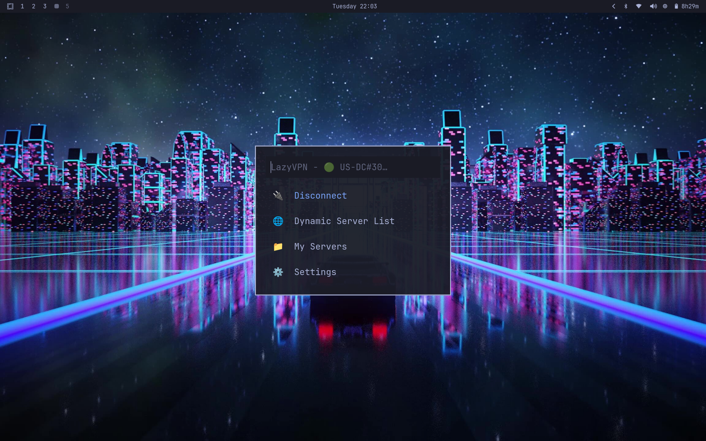
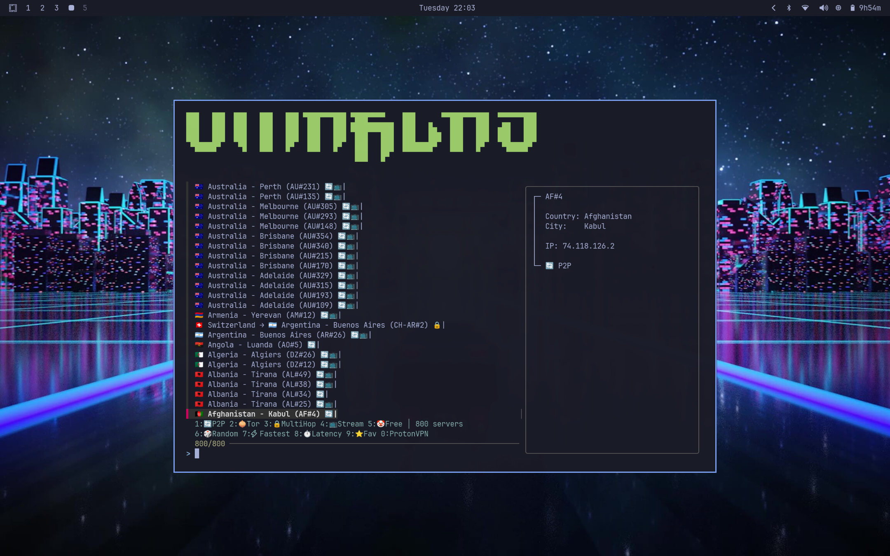
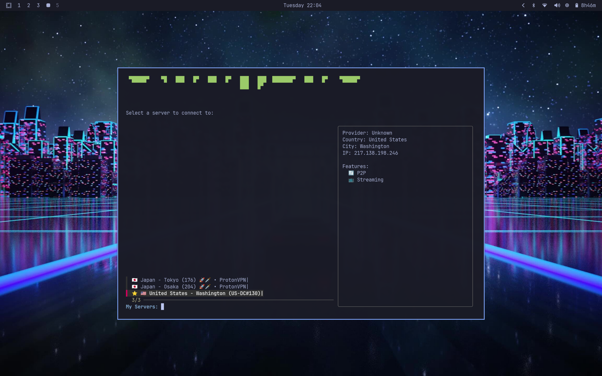
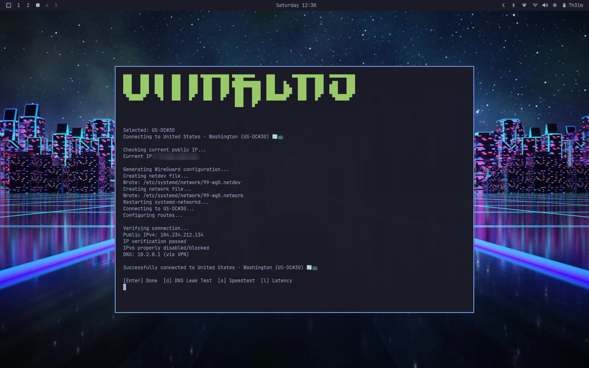
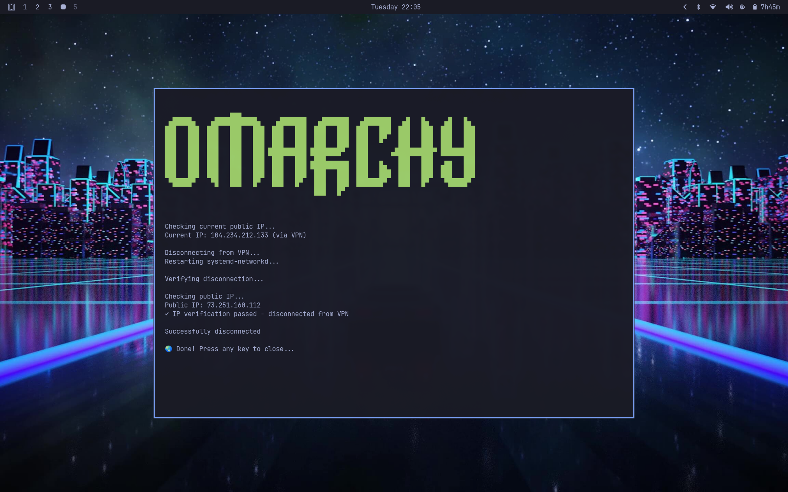
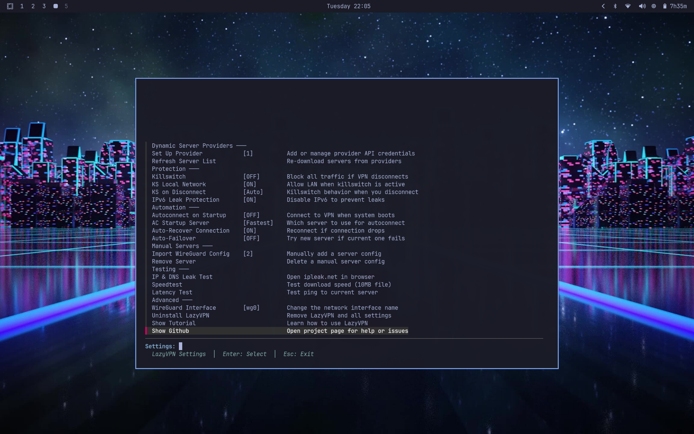

# LazyVPN - Omarchy VPN Manager

**Effortless privacy for Omarchy Linux.**

LazyVPN replaces manual network configuration with a fast, keyboard-driven interface. Browse thousands of servers, connect instantly, and stay protected with an ironclad killswitch—all without leaving your keyboard.

## Table of Contents

- [Quick Start](#quick-start)
- [Screenshots](#screenshots)
- [Why LazyVPN?](#why-lazyvpn)
- [Installation](#installation)
- [Dynamic Server Browser](#-dynamic-server-browser-new)
- [Intelligent Server Naming](#-intelligent-server-naming)
- [Security Architecture](#-security-architecture)
- [Usage Guide](#usage--menu-structure)
- [Troubleshooting](#troubleshooting)
- [Roadmap](#roadmap)
- [License](#license)

---

## Quick Start

**Get connected in 30 seconds:**

```bash
git clone https://github.com/blank-query/lazyVPN-for-Omarchy.git
cd lazyVPN-for-Omarchy
./install_lazyVPN.sh
```

🚀 **That's it!** Press `SUPER+L` to launch the menu.

1.  Select **Dynamic Server List**.
2.  Load **one** WireGuard config from your provider to authenticate.
3.  Instantly browse and connect to thousands of servers.

---

## Screenshots

### Main Menu



### Dynamic Server Browser


### My Servers


### Connection Flow



### Settings


### Waybar Integration


---

## Why LazyVPN?

*   **⚡ Blazing Fast:** Built with `fzf` and `jaq` for instant server filtering and navigation.
*   **🌐 No More Manual Configs:** The new **Dynamic Browser** lets you access your provider's entire fleet with just one setup step.
*   **🛡️ Ironclad Security:** Firewall-based killswitch and kernel-level IPv6 leak protection that persist across reboots.
*   **🎹 Keyboard Centric:** Navigate, filter, and connect entirely with hotkeys.
*   **🧠 Smart Automation:** Auto-connects to the fastest server on boot and self-heals if the connection drops.
*   **🎨 Beautiful Integration:** Seamlessly integrates with your Waybar and Omarchy desktop environment.

---

## Requirements

The installer automatically handles all software dependencies (`fzf`, `jaq`, `bc`, `iptables`, etc.).

**You only need:**
- **Omarchy Linux** (Strictly required for system integration)
- A VPN provider that supports WireGuard

**Supported Providers:**
✅ **ProtonVPN** (Verified & Recommended)
🧪 **Mullvad, IVPN, PIA, NordVPN, Surfshark** (Experimental support - [Help us test!](https://github.com/blank-query/lazyVPN-for-Omarchy/issues))

---

## Installation

```bash
git clone https://github.com/blank-query/lazyVPN-for-Omarchy.git
cd lazyVPN-for-Omarchy
./install_lazyVPN.sh
```

During installation, you can choose to enable **passwordless sudo** for seamless VPN operations (recommended).

---

## 🌐 Dynamic Server Browser (New!)

**Stop downloading hundreds of config files.**

LazyVPN revolutionizes how you manage servers. Instead of cluttering your disk with static `.conf` files, you now have live access to your provider's network.

*   **One-Time Setup:** Authenticate once with a single config file.
*   **Live Updates:** Server data is sourced from the excellent [gluetun](https://github.com/qdm12/gluetun) project (MIT License), ensuring robust and up-to-date server lists.
*   **Powerful Filters:**
    *   `1`-`5` : Toggle **P2P**, **Tor**, **Secure Core**, **Streaming**, **Free**
    *   `6` : **Random Connect** (selects randomly from *currently filtered* list)
    *   `7` : **Quickest** (tests latency of *currently filtered* servers)
    *   `9` : **Favorite** (Star servers to save them to "My Servers")

---

## 🏷️ Intelligent Server Naming

LazyVPN automatically parses cryptic filenames and metadata to present clean, readable server names with feature indicators.

| Raw Config Name | LazyVPN Display |
|-----------------|-----------------|
| `proton-us-ny-03` | 🇺🇸 United States - New York (US-NY#3) |
| `se-sto-p2p-05` | 🇸🇪 Sweden - Stockholm (SE-STO#5) 🔄 |
| `ch-us-01` | 🇨🇭 Switzerland → 🇺🇸 United States (CH-US#1) 🔒 |

**Feature Indicators:**
| Emoji | Feature |
|-------|---------|
| 🔄 | **P2P / Port Forward** |
| 🔒 | **Secure Core** (Multi-Hop) |
| 🧅 | **Tor Routing** |
| 📺 | **Streaming Optimized** |
| 🤡 | **Free Tier** |
| ⭐ | **Favorite** |

---

## 📁 My Servers

Your personal dashboard combining:
1.  **⭐ Favorites:** Servers you starred in the Dynamic Browser.
2.  **📄 Manual Configs:** Custom WireGuard files you've imported manually.

---

## 🔐 Security Architecture

LazyVPN is built on a "least privilege" security model, ensuring your system stays secure while offering the convenience of a TUI.

### 1. Privilege Separation
The core application runs as your normal user. Root access is strictly isolated to specific operations via the **`lazyvpn-file-helper`** script.
- **Validated Operations:** The helper script strictly validates all inputs (paths, filenames, content) to prevent path traversal or symlink attacks.
- **No Blanket Access:** The main application cannot modify arbitrary system files. It can only request the helper to write specific WireGuard configs to `/etc/systemd/network/`.

### 2. Credential Isolation
Your sensitive data stays in your control.
- **Private Keys:** Stored in `~/.config/lazyvpn/providers/` and `~/.config/lazyvpn/wireguard/` with **`chmod 600`** permissions (read/write only by you).
- **Runtime Only:** Private keys are **never** stored permanently in global system directories. They are injected into ephemeral `systemd-networkd` runtime configurations only when you actively connect, and are removed upon disconnection.

### 3. Restricted Sudo
The installer configures `/etc/sudoers.d/lazyvpn` to allow passwordless execution **only** for a specific allowlist of commands required for VPN operation:
- `networkctl` (to manage the interface)
- `iptables` (to manage the killswitch firewall rules)
- `lazyvpn-file-helper` (for secure file operations)

---

## Usage & Menu Structure

**Open Menu**: `SUPER+L`
**Navigate**: Arrow keys and Enter. Esc to go back.

### 🛡️ Protection & Automation
LazyVPN works silently in the background to keep you safe.

*   **Firewall Killswitch:** Blocks all traffic if the VPN drops. Can be configured to allow local network (printer/NAS) access.
*   **Auto-Recover:** Background daemon monitors connection health and reconnects automatically.
*   **Auto-Failover:** If a server goes down, automatically switches to the next best server.
*   **IPv6 Leak Protection:** Blocks IPv6 traffic at the kernel level to prevent leaks.

### 🧪 Testing Tools
Verify your privacy directly from the Settings menu:
*   **Latency Test:** Ping check to current server.
*   **Speedtest:** 10MB download test.
*   **IP & DNS Leak:** Opens `ipleak.net` in your browser.

---

## ✨ Deep System Integration

LazyVPN isn't just an app; it's part of your Omarchy desktop.

*   **Waybar Status:** A custom module appears automatically when connected, showing your provider, location flag, and IP. Click to open the menu.
*   **Omarchy Menu:** Fully integrated into the main system menu (`SUPER+ALT+SPACE`) with the native Omarchy visual style.
*   **Keybinding Helper:** Automatically registers `SUPER+L` in the Omarchy keybinding cheat sheet (`SUPER+K`).
*   **Desktop Notifications:** Native notifications for connection status and auto-recovery events.

---

## ⚡ Why WireGuard Only?

LazyVPN exclusively supports **WireGuard**. We do not support OpenVPN, and here is why:

*   **Performance:** WireGuard runs in the Linux kernel, offering significantly higher throughput and lower CPU usage than OpenVPN.
*   **Instant Connection:** WireGuard is stateless. Roaming between networks (WiFi/Ethernet) and connecting to servers is near-instantaneous.
*   **Native Integration:** By using WireGuard, we can leverage `systemd-networkd` directly, avoiding heavy external daemons and ensuring rock-solid stability.
*   **Simplicity:** WireGuard's modern codebase (~4k lines vs OpenVPN's 100k+) aligns with our philosophy of security and minimalism.

---

## Technical Details

**Network Stack**: Uses `systemd-networkd` for WireGuard interface management (not `wg-quick`)
**Firewall**: Custom iptables chains (`LAZYVPN_OUT` for IPv4/IPv6)
**DNS**: Integrates with `systemd-resolved` for DNS privacy
**Privilege Model**: Minimal sudo scope via `/etc/sudoers.d/lazyvpn`

**Configuration Files**:
- Settings: `~/.config/lazyvpn/config`
- Manual server configs: `~/.config/lazyvpn/wireguard/*.conf` (chmod 600)
- Provider credentials: `~/.config/lazyvpn/providers/*.conf` (chmod 600)

---

## Uninstallation

To remove LazyVPN and all associated files:
`lazyvpn-uninstall` (or via Settings menu)

**Secure Deletion:**
You will be prompted to securely shred credential files, config files, and sanitize shell history.

---

## Troubleshooting

**Killswitch blocks all traffic**
- Check "KS on Disconnect" setting. If set to "Never", internet remains blocked until you reconnect.
- **Emergency Disable**: Run `lazyvpn-disable-killswitch` from terminal.

**Provider setup shows "Invalid or sanitized private key"**
- ProtonVPN: Re-downloading an existing config gives a sanitized key (`****`). You must generate a **new** config from the Proton dashboard.

---

## Roadmap

### Planned Features
- Encrypted configuration storage for `.conf` files
- Support for additional VPN providers

**Suggestions welcome!** Open an issue on GitHub.

---

## Previous Version

The previous version of LazyVPN (without dynamic server browser) is preserved in the `old-stable` branch.

---

## License

MIT License - Copyright (c) 2025 blank-query

---

*WireGuard is a registered trademark of Jason A. Donenfeld.*