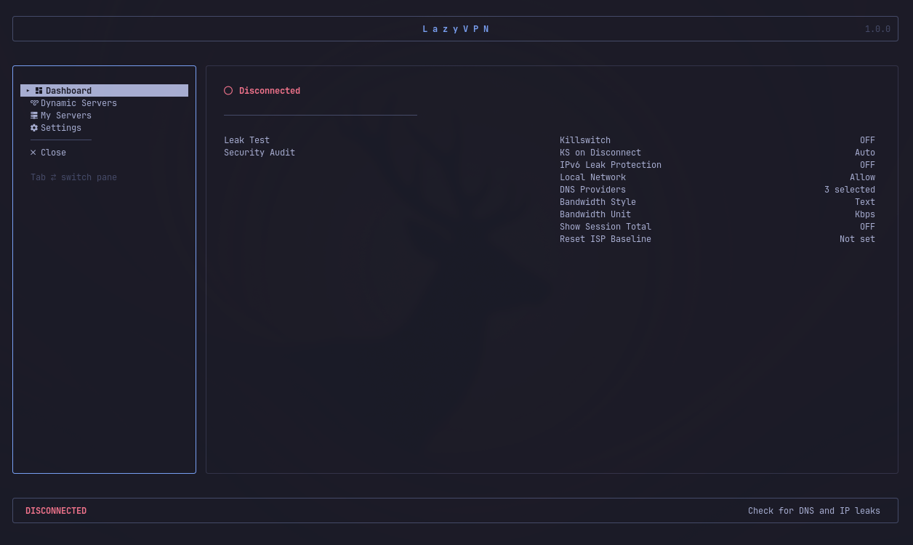
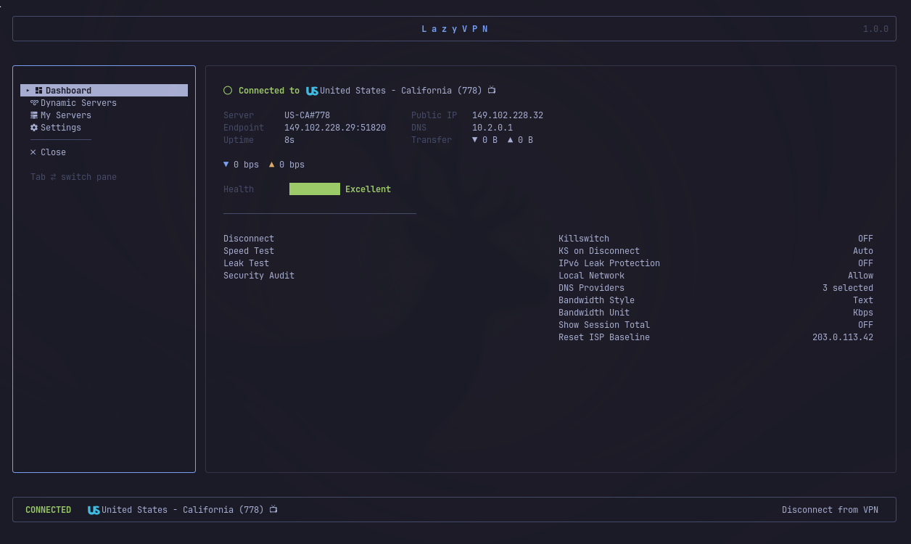
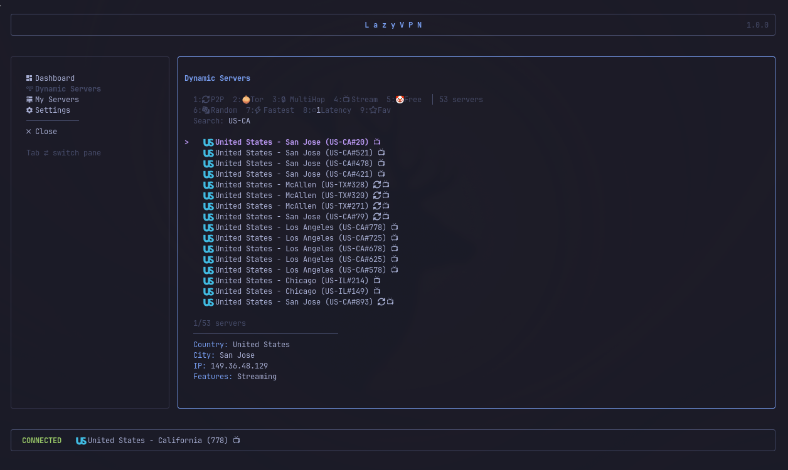
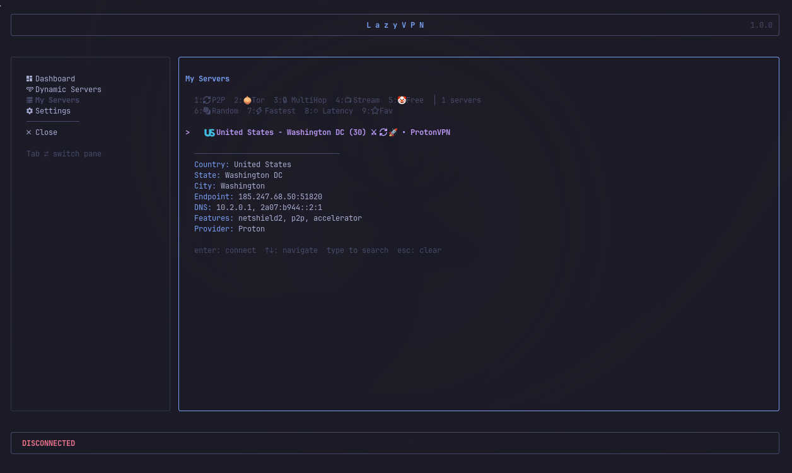
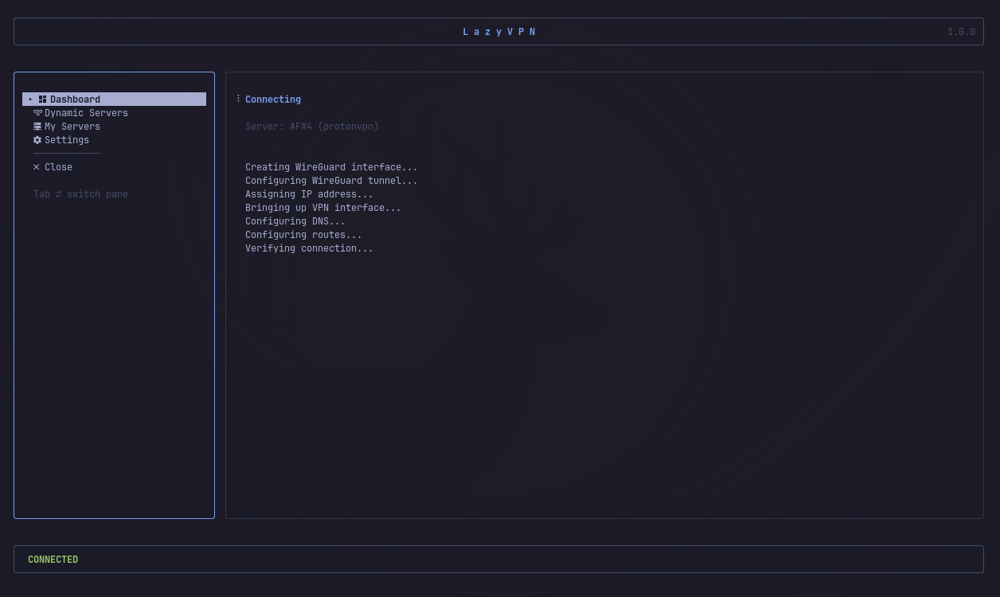
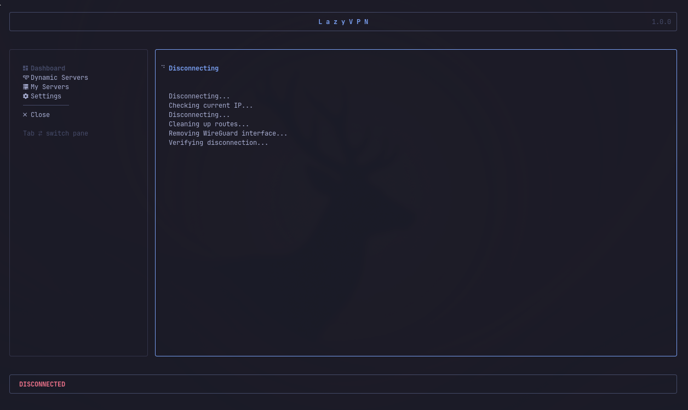
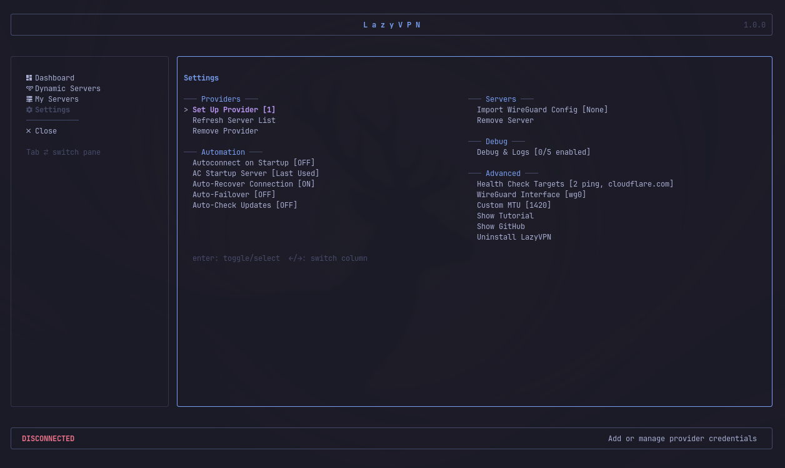
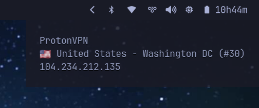

# LazyVPN - Omarchy VPN Manager

**Effortless privacy for Omarchy Linux.**

LazyVPN is a compiled Go binary with a built-in [Bubbletea](https://github.com/charmbracelet/bubbletea) TUI that replaces manual WireGuard configuration with a fast, keyboard-driven interface. Browse thousands of servers, connect instantly, and stay protected with a UFW-based killswitch — all without leaving your keyboard.

## Table of Contents

- [Quick Start](#quick-start)
- [Screenshots](#screenshots)
- [Why LazyVPN?](#why-lazyvpn)
- [Requirements](#requirements)
- [Installation](#installation)
- [CLI Reference](#cli-reference)
- [Dynamic Server Browser](#-dynamic-server-browser)
- [Intelligent Server Naming](#-intelligent-server-naming)
- [Security Architecture](#-security-architecture)
- [How LazyVPN deletes files](#-how-lazyvpn-deletes-files)
- [Privacy & Logging](#-privacy--logging)
- [Usage Guide](#usage--tui-overview)
- [Technical Details](#technical-details)
- [Troubleshooting](#troubleshooting)
- [Roadmap](#roadmap)
- [License](#license)

---

## Quick Start

**Get connected in 30 seconds:**

```bash
git clone https://github.com/blank-query/lazyVPN-for-Omarchy.git
cd lazyVPN-for-Omarchy
./lazyvpn install
```

Press `SUPER+SHIFT+L` to launch, or run `lazyvpn` from a terminal.

1. Go to **Settings > Set Up Provider**.
2. Load **one** WireGuard config from your VPN provider to authenticate.
3. Instantly browse and connect to thousands of servers.

---

## Screenshots

### Main Menu



<details>
<summary><b>View More Screenshots</b></summary>

### Main Menu (Connected)



### Dynamic Server Browser



### My Servers



### Connection Flow




### Settings



### Waybar Integration



</details>

---

## Why LazyVPN?

* **Compiled Go Binary:** Fast startup with no shell overhead or external dependencies.
* **Integrated TUI:** Full Bubbletea terminal interface — no external terminal tools like fzf or Walker needed.
* **UFW Killswitch:** Firewall-based killswitch with LAN block, stealth, and IPv6 leak protection.
* **Health Monitoring:** Real-time connection health scoring with auto-recovery and automatic failover.
* **Built-in Diagnostics:** Speed test, DNS/IP leak test, and full security audit — all inside the TUI.
* **Keyboard Centric:** Navigate, filter, and connect entirely with hotkeys.
* **Omarchy Integration:** Waybar status module, Hyprland keybindings, and system menu integration.

---

## Requirements

LazyVPN is a single binary with no runtime dependencies beyond what ships with Omarchy.

**You need:**

- **Omarchy Linux** (required for full system integration)
- **UFW** (firewall — pre-installed on Omarchy)
- **WireGuard kernel module** (pre-installed on Omarchy)
- A VPN provider that supports WireGuard — see [supported providers](docs/providers.md) for the full list and tiers

---

## Installation

```bash
git clone https://github.com/blank-query/lazyVPN-for-Omarchy.git
cd lazyVPN-for-Omarchy
./lazyvpn install
```

The installer runs through 11 steps:

1. **Install binary** to `~/.local/bin/lazyvpn`
2. **Create config directories** (`~/.config/lazyvpn/`)
3. **WireGuard interface name** — choose a name for the VPN interface (default: `wg0`)
4. **Configure VPN operations** — optional passwordless sudo for specific VPN commands (`ufw`, `ip`, `resolvectl`), set `CAP_NET_ADMIN` + `CAP_NET_RAW` file capabilities, and an optional system-wide IPv6 block
5. **Hyprland keybinding** — adds `SUPER+SHIFT+L` shortcut and floating window rules (Omarchy only)
6. **Legacy menu cleanup** — removes old bash-version menu entries if present (Omarchy only)
7. **Waybar module** — adds a status indicator that shows connection state, server, and health (Omarchy only)
8. **Application launcher** — adds a `.desktop` entry so LazyVPN appears in your app launcher
9. **PATH setup** — adds `~/.local/bin` to your PATH if needed
10. **Dependency check** — verifies UFW and WireGuard kernel module are available
11. **Color emoji font check** — verifies a color emoji font is installed so country-flag glyphs render correctly

The installer detects your distro and filesystem type automatically. Steps 5-7 are skipped on non-Omarchy systems.

---

## CLI Reference

```
lazyvpn [command]
```

After running `lazyvpn install`, the binary lives in `~/.local/bin/lazyvpn` and `~/.local/bin` is added to your `PATH`. Every command below is available globally from any directory — no need to be in the repo. The one exception is the *first* `install` invocation, which by definition has to run against some binary you already have on disk (a freshly built `./lazyvpn` from the repo, or a staging copy you've dropped somewhere like `/tmp`).

### Connection

| Command | Description |
|---------|-------------|
| *(no command)* | Launch the TUI. Everything you can do from the CLI you can do here, plus live dashboard, settings, leak test, audit, etc. |
| `random` | Pick any server (manual or dynamic) and connect. Near-instant — no latency probing. |
| `quickest` | Ping every reachable server and connect to the lowest-latency one. Takes ~30–60 s; requires outbound ICMP/UDP to reach candidate endpoints. |
| `daemon stop` | Stop the health-monitoring daemon and tear down any active tunnel in one shot. Equivalent to clicking **Disconnect** in the TUI. Useful for terminal-only workflows or when you need to force-disconnect without opening the UI. |
| `daemon status` | Show whether the daemon is running and, if so, its current state and server. |

### Killswitch

| Command | Description |
|---------|-------------|
| `killswitch enable` | Turn on the killswitch — blocks all non-VPN traffic via UFW. Intended as an emergency/standalone toggle; normal use flows through the TUI dashboard. |
| `killswitch disable` (alias: `killswitch off`) | Emergency unblock. Use this from a regular terminal if the killswitch leaves you locked out of the internet (e.g. after an unexpected disconnect or a stale rule set). |
| `killswitch status` | Print `Active` / `Inactive`. |

### Maintenance

| Command | Description |
|---------|-------------|
| `update` | Check GitHub for a newer release and, if you confirm, download + reinstall in place. |
| `version` | Print the build version. |
| `install` | Run the installer: lay down the binary, config dir, sudoers drop-in, capabilities, keybindings, Waybar integration, PATH entry. Safe to re-run; it updates in place. |
| `uninstall` | Undo everything the installer did, then optionally scrub debug logs, journal entries, shell history, and (on btrfs) trigger TRIM. |
| `help` | Print the built-in help summary. |

### Internal commands

These are invoked by the TUI, Waybar, or autostart hooks — you won't normally type them yourself, but they're not hidden:

| Command | Description |
|---------|-------------|
| `daemon run <server> [--provider P] [--dynamic]` | Spawns the long-running health daemon. Normally launched by the TUI or `random`/`quickest`; running it by hand is only useful for debugging. |
| `boot` | Autostart handler. Invoked by the `.desktop` autostart entry when the Autoconnect setting is enabled. |
| `waybar` | One-shot status emitter for the Waybar custom module. |

### Examples

```bash
lazyvpn                      # Launch TUI
lazyvpn random               # Connect to any server
lazyvpn quickest             # Connect to the fastest server (slow probe)
lazyvpn daemon stop          # Disconnect + stop daemon from the terminal
lazyvpn killswitch off       # Emergency: restore internet if KS locked you out
lazyvpn killswitch status    # Check whether the killswitch is active
lazyvpn update               # Check GitHub for a new release
```

---

## 🌐 Dynamic Server Browser

**Stop downloading hundreds of config files.**

LazyVPN gives you live access to your provider's full server network from inside the TUI. Authenticate once with a single config file, then browse everything.

* **One-Time Setup:** Go to Settings > Set Up Provider with one WireGuard config.
* **Server Data:** Server lists are derived from the excellent [gluetun-servers](https://github.com/qdm12/gluetun-servers) project (MIT License). LazyVPN mirrors them into this repo's `server-data` branch — refreshed weekly by a GitHub Action — and fetches from there rather than upstream directly, so the app keeps working off the last good snapshot even if upstream moves or disappears.
* **Fuzzy Search:** Type to filter servers instantly.
* **Hotkeys:**
  * `1`-`5` : Toggle filters — **P2P**, **Tor**, **Secure Core**, **Streaming**, **Free**
  * `6` : **Random Connect** (from currently filtered list)
  * `7` : **Quickest** (auto-measures latency, connects to fastest)
  * `8` : **Measure Latency** (ping all visible servers)
  * `9` : **Toggle Favorite** (star servers to save them to My Servers)
  * `0` : **Cycle Provider** (when multiple providers are set up)

> **Note:** Feature filters work best with ProtonVPN. Mullvad does not publish per-server feature data, so their servers won't appear when filtering by P2P, Tor, etc.

---

## 🏷️ Intelligent Server Naming

LazyVPN automatically parses cryptic filenames and metadata to present clean, readable server names with feature indicators.

| Raw Config Name   | LazyVPN Display                                    |
| ----------------- | -------------------------------------------------- |
| `proton-us-ny-03` | 🇺🇸 United States - New York (US-NY#3)            |
| `se-sto-p2p-05`   | 🇸🇪 Sweden - Stockholm (SE-STO#5) 🔄              |
| `ch-us-01`        | 🇨🇭 Switzerland → 🇺🇸 United States (CH-US#1) 🔒 |

**Feature Indicators:**
| Emoji | Feature |
|-------|---------|
| 🔄 | **P2P / Port Forward** |
| 🔒 | **Secure Core** (Multi-Hop) |
| 🧅 | **Tor Routing** |
| 📺 | **Streaming Optimized** |
| 🤡 | **Free Tier** |
| ⭐ | **Favorite** |

---

## 📁 My Servers

Your personal server list combining:

1. **⭐ Favorites:** Servers you starred in the Dynamic Browser.
2. **📄 Manual Configs:** Custom WireGuard files you've imported manually.

---

## 🔐 Security Architecture

LazyVPN is built on a "least privilege" security model.

### 1. Native Network Management

LazyVPN uses Linux netlink and wgctrl directly to create and manage WireGuard interfaces — no systemd-networkd config files, no shell scripts. The binary is granted `CAP_NET_ADMIN` and `CAP_NET_RAW` file capabilities, which means it can manage network interfaces without running as root.

### 2. Credential Isolation

Your sensitive data stays in your control.

- **Private Keys:** Stored in `~/.config/lazyvpn/providers/` and `~/.config/lazyvpn/wireguard/` with `chmod 600` permissions (read/write only by you).
- **Runtime Only:** Keys are loaded into memory during connection and never written to system directories.

### 3. Restricted Sudo Scope

The sudoers configuration (`/etc/sudoers.d/lazyvpn`) grants passwordless execution **only** for a specific allowlist:

- `ufw` — firewall management (killswitch, LAN block, stealth, IPv6)
- `ip` — interface, address, and route management
- `resolvectl` — DNS configuration via systemd-resolved
- `sysctl` — IPv6 kernel parameter toggle (scoped to lazyvpn sysctl file)
- `systemctl` — start/stop journald only (scoped commands; no `systemd-networkd` — the rewrite uses netlink directly)
- `setcap` — setting file capabilities on the binary
- `rm` — removing LazyVPN-owned files during uninstall (scoped paths only)
- `shred -u` — **on ext4/xfs only.** LazyVPN's installer detects the filesystem and emits this rule only where it does something real; on Btrfs/ZFS the rule is omitted entirely.

### 4. Zero Unexpected Traffic

**You are in control.** LazyVPN never initiates network traffic without your explicit consent.

- **No Telemetry:** No usage statistics, analytics, or tracking of any kind.
- **Opt-In Update Checks:** Update checks are disabled by default. If you enable "Auto-Check Updates" in Settings, LazyVPN checks GitHub once per day for new releases. Nothing is installed without your confirmation.
- **On-Demand Only:** Server lists are only refreshed when you explicitly request it.
- **No Background Chatter:** The auto-recover daemon only pings your VPN endpoint to check connectivity; it sends no other data.

### 5. Deletion & Cleanup

When you uninstall, or when you remove a provider or server, LazyVPN runs the file-removal tool that actually works on your filesystem — no theater. See [💽 How LazyVPN deletes files](#-how-lazyvpn-deletes-files) for what each tool guarantees (and what it doesn't).

* **Journal scrubbing:** Scans each binary journal file under `/var/log/journal/`, flags only files that mention LazyVPN / WireGuard / your tunnel interface, and deletes those specific files (the rest of your system logs are preserved).
* **Shell-history filtering:** Rewrites `.bash_history` / `.zsh_history` / `fish_history` in place, dropping lines that reference LazyVPN, WireGuard, or provider config filenames — other history entries are kept.
* **No silent fallback:** If a delete fails, the uninstaller lists the failure and prompts you: retry with sudo, fall back to `rm` (non-CoW only — you get to decide), or skip. Skipped and fallback files are listed with a bug-report link at the end so nothing is quietly swept under the rug.

---

## 💽 How LazyVPN deletes files

The right tool depends on the filesystem. LazyVPN picks the one that actually does something, and tells you exactly which command ran. No "verified secure" framing on top of a plain `rm`.

### Traditional filesystems (ext4, xfs)

Runs `shred -u <path>` — overwrites the file three times then unlinks it. Because these filesystems write updates in place, the overwrite lands on the same physical disk blocks as the original data, so recovery from the block device is very unlikely without dedicated forensic hardware.

### Copy-on-write filesystems (Btrfs, ZFS)

Runs `rm <path>`. That unlinks the directory entry; the content remains on disk until those blocks are reused for something else.

LazyVPN does **not** run `shred` on CoW filesystems. CoW writes updates to newly-allocated extents while leaving the originals intact, so `shred`'s overwrite passes would go to fresh blocks — the original data would be untouched, and the claim "securely deleted" would be a lie. The honest answer is `rm` plus the caveat below.

### What `rm` does not guarantee

`rm` removes the directory entry. It does not wipe the blocks. Until those blocks are overwritten by later writes, a forensic read of the raw device could recover the content. On an SSD, the drive's `fstrim.timer` (enabled by default on most distros — check with `systemctl status fstrim.timer`) weekly issues TRIM hints that tell the drive to actually erase freed blocks, but this is opportunistic, not immediate.

### If you need stronger guarantees

Filesystem-level delete tools can't reliably wipe CoW extents, can't force SSD flash cell erasure, and can't touch data in filesystem snapshots (Btrfs `snapper`, ZFS snapshots). For credentials-grade guarantees use **full-disk encryption at rest** (LUKS on the block device) so that anything on disk — live file or reclaimed block — is useless without your passphrase.

### Runtime behavior

The uninstaller reports each file's outcome in plain language (`shredded`, `removed`, `file not found`, `failed`). If any file fails to delete, you get an interactive prompt — retry with sudo, fall back to `rm` on non-CoW, or skip — with a final summary that flags any fallback or skipped files with a bug-report link.

---

## 🕵️ Privacy & Logging

LazyVPN is designed with a "zero-knowledge" philosophy for your local machine.

* **No Logs by Default:** LazyVPN does not log your activity, connection times, or errors unless you explicitly enable Debug Mode.
* **Opt-In Debugging:** Enable temporary logging in Settings > Debug & Logs.
  * **Granular Categories:** Connection, Auto-Recover, Firewall Events, Provider Parsing, Autostart — enable only what you need.
  * **Safe Mode (Default):** Debug logs automatically redact WireGuard private keys and public IP addresses.
  * **Accurate Mode:** Full, unredacted details for deep troubleshooting.
  * **UFW Packet Log:** Separately control kernel-level UFW packet logging (off/low/medium/high/full).
* **Startup Alert:** If any logging is still enabled when you launch LazyVPN, the footer bar shows a reminder so you don't forget to turn it off.
* **Log removal on uninstall:** debug logs, journal entries with VPN evidence, and shell history lines referencing LazyVPN/WireGuard get deleted using the filesystem-appropriate tool (see [💽 How LazyVPN deletes files](#-how-lazyvpn-deletes-files)). If a delete fails you're prompted to retry, fall back, or skip — no silent recovery.
* **Clean Uninstallation:** The uninstaller resets UFW packet logging to off, prompts you about the debug-log file, removes credentials/config/cache, filters VPN entries out of your journal and shell history, and prints a per-file summary so you can see what ran.

---

## Usage & TUI Overview

**Launch:** `SUPER+SHIFT+L` or `lazyvpn` from terminal.
**Navigate:** Arrow keys, Enter to select, Esc to go back, Tab to switch panes.

### First Run

On first launch, LazyVPN offers a short interactive tutorial covering navigation, provider setup, and key features. You can skip it or revisit it later from Settings.

When you navigate to Dynamic Servers for the first time without a provider configured, LazyVPN prompts you to set one up — just point it at a single WireGuard config from your VPN provider and you're in.

### Dashboard (Connected)

When connected, the dashboard shows real-time information:

- **Server name** with country flag and feature indicators
- **Health grade** (Excellent/Good/Fair/Poor/Bad) computed from handshake age, latency, packet loss, and DNS health
- **Bandwidth** with live download/upload speeds and sparkline/bar visualizations
- **Network stats** (RX/TX bytes and packets)
- **Endpoint** and last handshake time

**Dashboard Actions:**
| Action | Description |
|--------|-------------|
| Disconnect | Disconnect from VPN |
| Speed Test | 10MB download speed test |
| Leak Test | Check for DNS and IP leaks |
| Security Audit | Full security audit of VPN connection |

**Dashboard Toggles:**
| Toggle | Options | Description |
|--------|---------|-------------|
| Killswitch | On / Off | Block all traffic if VPN drops |
| KS on Disconnect | Auto / Prompt / Never | Killswitch behavior when you manually disconnect |
| IPv6 Leak Protection | On / Off | Disable IPv6 to prevent leaks |
| Local Network | Allow / Stealth / Block | LAN access mode (see below) |
| DNS Providers | *N* selected | Choose DNS services for leak test |
| Bandwidth Style | Sparkline / Bar / Text | Display mode for bandwidth graphs |
| Bandwidth Unit | KB/s / Kbps | Speed unit preference |
| Show Session Total | On / Off | Show total bytes transferred |
| Reset ISP Baseline | — | Clear ISP fingerprint for leak detection |

**LAN Modes:**
- **Allow:** Full LAN access (printers, file shares, NAS, etc.)
- **Stealth:** Outbound LAN works, inbound blocked (coffee shop mode)
- **Block:** All LAN traffic blocked in both directions (maximum isolation)

### Settings Screen

The Settings screen is organized in a two-column layout with 5 sections:

**Left Column:**
- **Providers** — Set up provider, refresh server list, remove provider
- **Automation** — Autoconnect on startup, startup server selection, auto-recover, auto-failover, auto-check updates

**Right Column:**
- **Servers** — Import WireGuard configs, remove servers
- **Debug** — Opens the "Debug & Logs" sub-view (shows summary like "2/5 enabled")
- **Advanced** — Health check targets, WireGuard interface name, custom MTU, tutorial, GitHub link, uninstall

**Debug & Logs Sub-View:**
- Per-category log toggles: Connections, Auto-Recover, Firewall Events, Provider, Autostart
- Log Mode: Safe (redacts IPs/keys) or Accurate (full details)
- View/Clear debug log
- UFW Packet Log level (off/low/medium/high/full)

### 🛡️ Protection & Automation

* **Firewall Killswitch:** Blocks all non-VPN traffic using UFW deny rules. If the killswitch is still active at shutdown — because you powered off while connected, set "KS on Disconnect" to Never, or declined the disable prompt — the rules persist across reboots. This means your traffic is never exposed, even during an unexpected restart. Combined with Autoconnect, your VPN reconnects on boot while the killswitch keeps you protected during the brief window before the tunnel is up. Configurable behavior on manual disconnect (Auto / Prompt / Never).
* **Auto-Recover:** Background daemon monitors connection health every 5 seconds and reconnects automatically.
* **Auto-Failover:** If a server goes down, automatically switches to the next best server.
* **Auto-Check Updates:** Opt-in daily check for new releases on GitHub. Notifies you in the TUI nav bar when an update is available. Nothing is downloaded or installed without your confirmation.
* **IPv6 Leak Protection:** Disables IPv6 at the kernel level via sysctl to prevent leaks.
* **ISP Baseline Detection:** Captures your ISP's IP and DNS before first connect. Leak tests compare against this baseline — "matches ISP = leak" instead of relying on VPN provider recognition.

---

## ✨ Deep System Integration

LazyVPN is part of your Omarchy desktop.

* **Waybar Status:** Custom module shows connection state, server flag, and health. Animates when connecting, hides when disconnected. Click to launch TUI.
* **App Launcher:** `.desktop` entry makes LazyVPN searchable in your application launcher (`SUPER+SPACE`).
* **Keybinding:** `SUPER+SHIFT+L` launches LazyVPN in a floating window.
* **Desktop Notifications:** Native notifications for connection status and auto-recovery events.

---

## ⚡ Why WireGuard Only?

LazyVPN exclusively supports **WireGuard**:

* **Performance:** WireGuard runs in the Linux kernel with significantly higher throughput and lower CPU usage than OpenVPN.
* **Instant Connection:** WireGuard is stateless. Roaming between networks and connecting to servers is near-instantaneous.
* **Native Integration:** Using WireGuard with netlink and wgctrl gives direct kernel-level control without external daemons.
* **Simplicity:** WireGuard's modern codebase (~4k lines vs OpenVPN's 100k+) aligns with our philosophy of security and minimalism.

---

## Technical Details

| Component | Implementation |
|-----------|---------------|
| **Network** | Native netlink + wgctrl (not systemd-networkd, not wg-quick) |
| **Firewall** | UFW with tagged rules (`lazyvpn:ks`, `lazyvpn:lb`, `lazyvpn:st`, `lazyvpn:v6`) |
| **DNS** | systemd-resolved integration via `resolvectl` |
| **Privilege** | `CAP_NET_ADMIN` + `CAP_NET_RAW` file capabilities; sudoers for UFW |
| **TUI** | [Bubbletea](https://github.com/charmbracelet/bubbletea) with Lip Gloss styling |
| **Daemon** | Built-in health monitoring — handshake age, latency, packet loss, DNS scoring |

**Health Scoring:**

The daemon computes a 0-100 health score from four equally-weighted factors:
- **Handshake:** 100 if <3min, linear decay to 0 at 7min
- **Latency:** 100 if <100ms, 50 at 300ms, 0 at 1000ms
- **Packet Loss:** Computed from a sliding window of 20 pings
- **DNS:** Starts at 100, drops 33 per consecutive failure

Health check targets are configurable via Settings > Advanced > Health Check Targets. Defaults: ping targets `8.8.8.8:53` and `1.1.1.1:53` (TCP dial), DNS probe host `cloudflare.com`.

Grades: Excellent (90+), Good (80+), Fair (70+), Poor (60+), Bad (<60)

**Configuration Files:**

- Settings: `~/.config/lazyvpn/config.json`
- Manual server configs: `~/.config/lazyvpn/wireguard/*.conf` (chmod 600)
- Provider credentials: `~/.config/lazyvpn/providers/*.json` (chmod 600)
- Server cache: `~/.config/lazyvpn/cache/*.json`
- Debug log: `~/.config/lazyvpn/debug.log`

---

## Uninstallation

From the TUI: Settings > Advanced > Uninstall LazyVPN

Or from terminal: `lazyvpn uninstall`

**What it does:** runs 16 numbered cleanup steps — tears down UFW killswitch/LAN/IPv6 rules, stops the daemon, removes Hyprland keybindings + window rules, removes Waybar integration, removes from PATH, removes autostart and `.desktop` entries, prompts about deleting the debug log, deletes credential files + config + cache + WireGuard configs (opt-in), prompts about journal entries (sudo) + shell history, removes the sudoers file, removes the binary, and on btrfs prompts about scanning snapper snapshots. Each delete is reported per-file — either `shredded`, `removed`, `file not found`, or `failed` — so you can see exactly what ran.

**On failure, it prompts you.** If a file can't be deleted, the uninstaller stops and asks: retry with sudo, fall back to `rm` (non-CoW installs only; flagged as insecure so you can report the path), or skip. No silent recovery. A final summary banner tallies what used which tool and lists any fallback/skipped files with a bug-report link.

See [💽 How LazyVPN deletes files](#-how-lazyvpn-deletes-files) for what each tool guarantees.

---

## Troubleshooting

**Killswitch blocks all traffic**

- Check the "KS on Disconnect" setting. If set to "Never", internet remains blocked until you reconnect.
- **Emergency Disable:** Run `lazyvpn killswitch disable` from terminal.

**Killswitch blocks traffic after sleep/wake**

- This is a [known issue across Linux VPN clients](https://github.com/basecamp/omarchy/discussions/3424). After system sleep, the VPN tunnel may be stale while killswitch rules remain active.
- LazyVPN's daemon attempts to detect wake and reconnect automatically, but recovery may not always succeed.
- **If locked out after wake:** Run `lazyvpn killswitch disable` from a terminal.

**LAN block prevents local network access**

- When LAN mode is set to "Block", all traffic to/from private IP ranges (10.x, 172.16-31.x, 192.168.x) is denied.
- If you need printer/NAS access, switch to "Allow" or "Stealth" via the dashboard toggle.
- If your VPN's DNS server is on a private IP (e.g., 10.2.0.1), LazyVPN automatically adds an exception for it.

**Provider setup shows "Invalid or sanitized private key"**

- ProtonVPN: Re-downloading an existing config gives a sanitized key (`****`). You must generate a **new** config from the Proton dashboard.

**Connection drops immediately**

- Check `lazyvpn killswitch status` to see if stale rules are interfering.
- Enable debug logging (Settings > Debug & Logs > Log Connections) and check `~/.config/lazyvpn/debug.log`.

---

## Roadmap

### Planned Features

- Expanded linux support beyond Omarchy.
- Expanded support and testing for additional VPN providers.

**Suggestions welcome!** Open an issue on [GitHub](https://github.com/blank-query/lazyVPN-for-Omarchy).

---

## Previous Version

The previous bash-script version of LazyVPN (Walker menus, fzf browser, iptables killswitch) is preserved on the `old-stable` branch.

---

## License

MIT License - Copyright (c) 2025 blank-query

---

*WireGuard is a registered trademark of Jason A. Donenfeld.*
