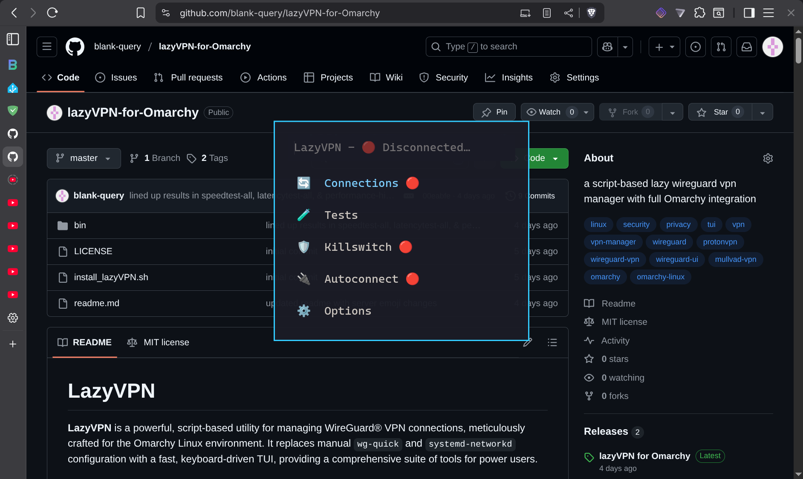
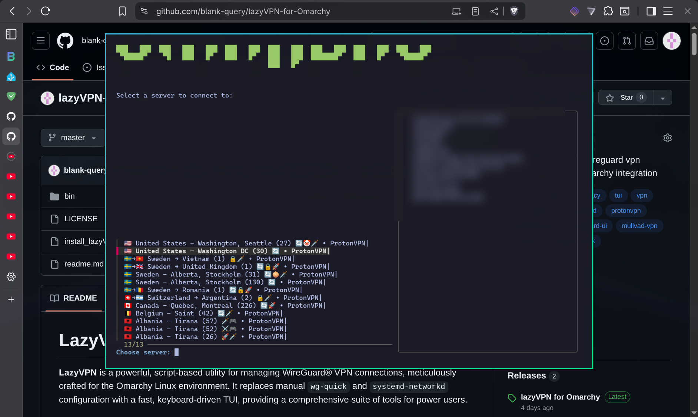
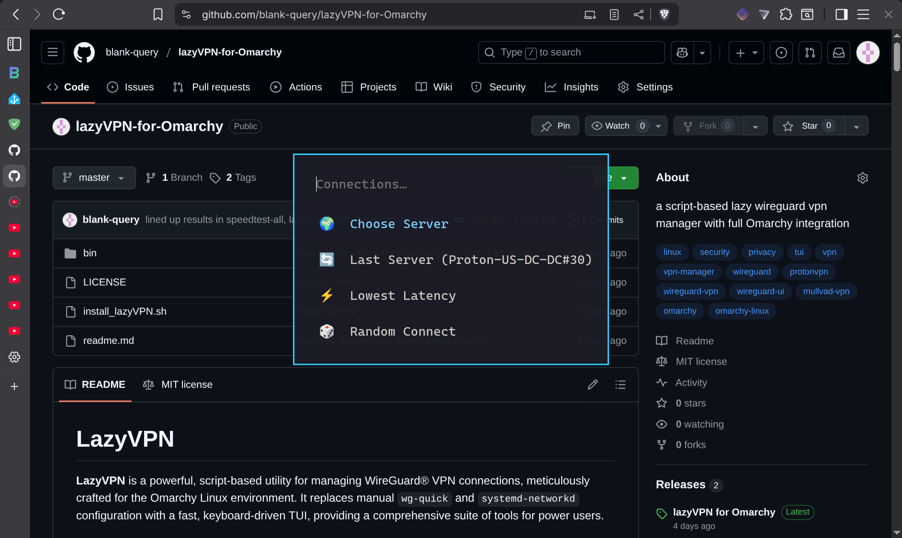
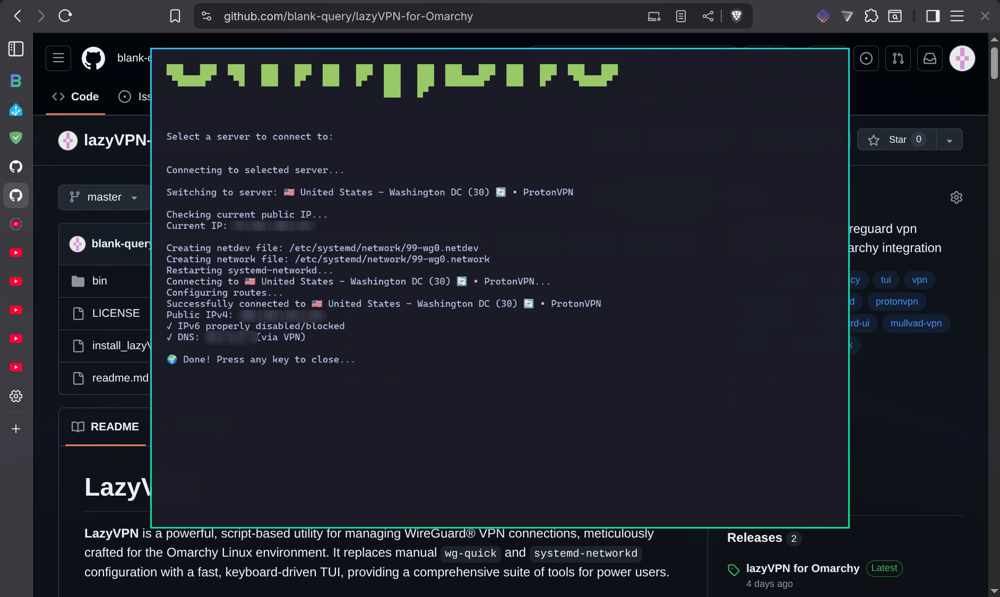
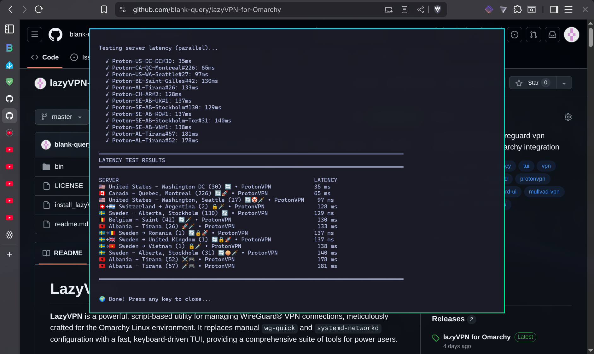
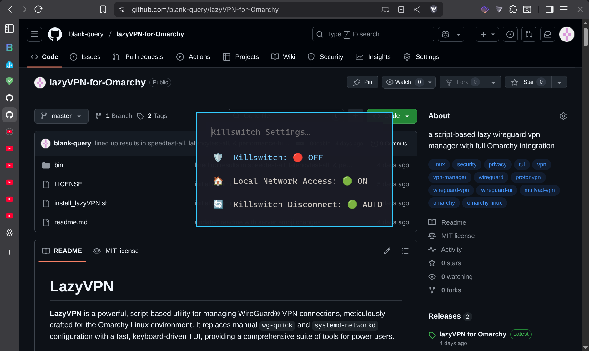
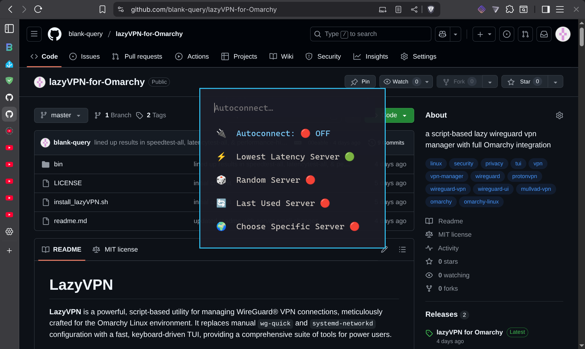
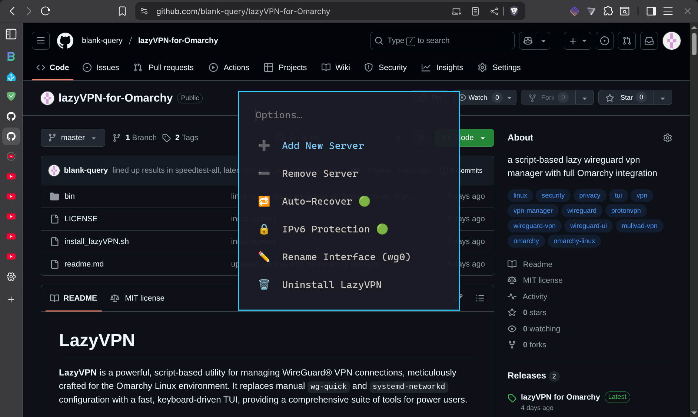
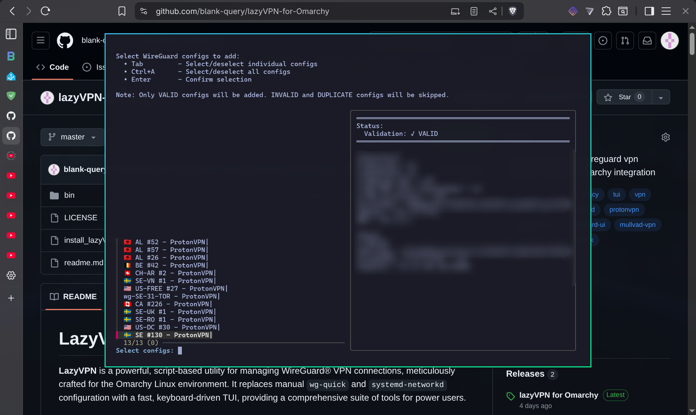
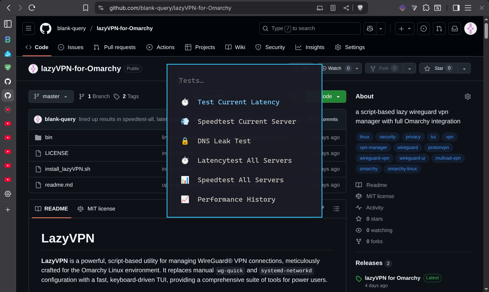

# LazyVPN

**LazyVPN** is a powerful, script-based utility for managing WireGuard® VPN connections, meticulously crafted for the Omarchy Linux environment. It replaces manual `wg-quick` and `systemd-networkd` configuration with a fast, keyboard-driven TUI, providing a comprehensive suite of tools for power users.

## Table of Contents

- [Core Philosophy](#core-philosophy)
- [Screenshots](#screenshots)
- [Feature Matrix](#feature-matrix)
  - [Connection Management](#-connection-management)
  - [Security & Privacy](#-security--privacy)
  - [Automation & Configuration](#-automation--configuration)
  - [Performance & Testing](#-performance--testing)
  - [System Integration](#-system-integration)
- [Requirements](#requirements)
- [Installation](#installation)
- [First-Time Setup](#first-time-setup)
- [Standardized Server Naming](#standardized-server-naming)
- [Usage](#usage)
- [Menu Structure](#menu-structure)
- [Uninstallation](#uninstallation)
- [Roadmap](#roadmap)
- [License](#license)

---

## Core Philosophy

-   **Speed & Efficiency**: Every action is a few keystrokes away. No mouse required.
-   **Control**: Granular control over your connection, security, and automation.
-   **Intelligence**: The system is smart. It detects providers, parses server names, and automatically handles complex tasks.
-   **Resilience**: With features like the auto-recover daemon and atomic configuration saves, LazyVPN is built to be reliable.
-   **Transparency**: Understand your connection with detailed status info, performance tests, and leak protection.

---

## Screenshots

### Main Menu

*The main menu when disconnected, showing all available options*

### Server Selection with Feature Indicators

*Interactive server picker with country flags, feature emojis, and real-time filtering*

### Connection Modes

*Choose how to connect: lowest latency, random, specific server, or last used*

### Connecting to a Server

*Real-time connection status with IP verification and DNS leak protection*

### Latency Testing

*Parallel latency testing across all servers with sorted results*

### Advanced Configuration

<details>
<summary>Click to see more screenshots</summary>

#### Killswitch Settings

*Firewall killswitch with local network access and disconnect behavior options*

#### Autoconnect Settings

*Configure automatic connection on boot with multiple mode options*

#### Options Menu

*Server management, auto-recover daemon, IPv6 protection, and more*

#### Adding Servers

*Smart server import with automatic validation, provider detection, and duplicate prevention*

#### Testing Menu

*Comprehensive testing suite including latency, speed, DNS leak tests, and performance history*

</details>

---

## Feature Matrix

### 🔄 Connection Management

-   **Multiple Connection Modes**:
    -   **⚡ Lowest Latency**: Automatically performs parallel latency tests against all servers and connects to the one with the lowest ping.
    -   **🎲 Random Server**: Connect to a randomly selected server for effortless privacy.
    -   **🌍 Choose Server**: Select a server from a filterable, `fzf`-powered list with a detailed preview panel.
    -   **🔄 Last Used Server**: Instantly reconnect to your most recent server.
-   **Smart Server Display**:
    -   **Automatic Server Renaming**: When adding servers, LazyVPN automatically renames them to a standardized format using provider detection, filename parsing, and IP geolocation as fallback.
    -   **Pretty Names**: Displays servers with full location names and country flags (e.g., `🇺🇸 United States - New York (123) • ProtonVPN`).
    -   **Feature Emojis**: Visual indicators show server capabilities at a glance: 🔄 P2P/Torrenting, 🔒 Secure Core, 🧅 Tor, 🤡 Free Tier, 🚀 VPN Accelerator, 🗡️ NetShield Level 1, ⚔️ NetShield Level 2, 🎮 Moderate NAT.
    -   **Provider Detection**: Intelligently detects VPN providers (ProtonVPN, Mullvad, IVPN, PIA, NordVPN, Surfshark, etc.) from endpoint, DNS, or config file contents.
-   **Connection Status**: The menu bar always shows your real-time status (`🟢 CONNECTED` or `🔴 DISCONNECTED`) and the currently connected server.
-   **Seamless Server Switching**: Switches between servers gracefully, automatically updating firewall rules and routes.

### 🛡️ Security & Privacy

-   **Advanced Firewall Killswitch**:
    -   An `iptables`-based killswitch that blocks all internet traffic if the VPN disconnects, preventing any data leaks.
    -   **Dynamic Updates**: The killswitch is smart. It automatically allows traffic to the new VPN endpoint *before* connecting, ensuring seamless server switching without ever disabling the killswitch.
    -   **Configurable Local Network Access**: Toggle whether to allow access to local network devices (printers, NAS, etc.) while the killswitch is active.
    -   **Configurable Disconnect Behavior**: Choose what happens when you manually disconnect:
        -   `🟢 AUTO`: Automatically disable the killswitch.
        -   `🟡 PROMPT`: Ask whether to disable the killswitch.
        -   `🔴 NEVER`: Keep the killswitch active, ensuring the internet remains blocked until you reconnect.
-   **🔁 Auto-Recover Daemon**:
    -   A background daemon constantly monitors the health of your VPN connection.
    -   If it detects a drop or stall, it will automatically attempt to reconnect to the same server.
    -   Toggle from `⚙️ Options` → `🔁 Auto-Recover`.
-   **🔒 IPv6 Leak Protection**:
    -   Actively checks for and prevents IPv6 leaks by default.
    -   Can be toggled from the menu if you need to use IPv6.
-   **🧪 DNS Leak Test**:
    -   A built-in test to verify that your DNS queries are being correctly routed through the VPN's DNS servers, not your ISP's.
-   **🗑️ Secure Deletion**:
    -   **During Normal Usage**:
        -   When adding servers: Optional prompt to securely delete original `.conf` files from Downloads (after successful import)
        -   When removing servers: Automatically shreds server config and its performance history
    -   **During Uninstall**:
        -   Performance history logs (usage metadata) - always shredded
        -   LazyVPN config files - always shredded
        -   Server configs (private keys) - shredded if user chooses to delete them
        -   systemd-networkd files (private keys) - always shredded
        -   System journal logs - optional surgical removal (only files containing VPN logs, preserves clean journals)
        -   Shell history - automatically cleaned of all VPN-related commands (bash, zsh, fish)
    -   All secure deletion uses `shred` with 3-pass overwrite to prevent forensic recovery
-   **📁 Configuration Storage**:
    -   Server configurations are currently stored in plaintext in `~/.config/lazyvpn/wireguard/`
    -   **Note**: Encrypted storage is a planned optional feature (see [Roadmap](#roadmap))

### ⚙️ Automation & Configuration

-   **🔌 Autoconnect on Boot**:
    -   Set LazyVPN to automatically connect when you log in.
    -   **Multiple Autoconnect Modes**:
        -   Connect to the `last used` server.
        -   Connect to the `lowest latency` server.
        -   Connect to a `random` server.
        -   Connect to a `specific` server of your choice.
-   **➕ Easy Server Management**:
    -   **Add Servers**: A guided `fzf` interface to import `.conf` files from `~/Downloads` with:
        -   Automatic validation (before and after import)
        -   Provider detection and location detection (via IP geolocation if needed)
        -   Standardized renaming and duplicate prevention
        -   Optional cleanup prompt to securely delete original files from Downloads after successful import (uses `shred` to overwrite before deletion)
    -   **Remove Servers**: Securely delete servers (configs shredded, not just deleted) with automatic cleanup of performance history and configuration references.
    -   Both accessible from `⚙️ Options` submenu.
-   **✏️ Interface Renaming**: Easily rename the network interface (e.g., from `wg0` to `lazyvpn`) directly from the menu.
-   **Robust Configuration**:
    -   Uses atomic file writes to prevent configuration corruption.
    -   **Interactive Recovery**: If the config file is ever deleted or corrupted, LazyVPN will guide you through an interactive prompt to recreate it.
    -   **Automatic Migration**: Handles upgrades and configuration changes from older versions seamlessly.

### 📊 Performance & Testing

-   **⏱️ Latency Testing**:
    -   Test the latency of the currently connected server.
    -   **Test All Servers**: Run parallel latency tests on all servers to find the quickest.
-   **💨 Speed Testing**:
    -   Run a download speed test on the currently connected server.
    -   **Test All Servers**: A comprehensive test that connects to *each server one-by-one*, runs a speed test, and presents a sorted list of the fastest servers.
    -   Both "Test All" features include an option to test your direct, non-VPN connection for comparison.
    -   Non-VPN results are recorded in performance history as `🌐 Direct (Non-VPN)`.
-   **📈 Performance History**:
    -   Automatically records the results of every latency and speed test.
    -   View a summary of average speeds and latencies for all servers.
    -   View a detailed log of the last 20 tests for any specific server.

### ✨ System Integration

-   **Omarchy Menu**: Adds a "LazyVPN" entry to the main Omarchy menu (`SUPER+ALT+SPACE`).
-   **Dedicated Keybinding**: Launch the menu instantly with `SUPER+L` (automatically registered in the Omarchy keybind help menu at `SUPER+K`).
-   **Passwordless Operation (Optional)**: During installation, you can choose to enable passwordless sudo for specific VPN-related commands only (`networkctl`, `ip route`, `iptables`, systemd-networkd operations). If disabled, you'll be prompted for password when connecting/disconnecting.
-   **Desktop Notifications**: Provides clear notifications for connects, disconnects, and other key events.
-   **Smart Change Detection**: Automatically detects when you add or remove `.conf` files and notifies you.

---

## Requirements

-   **Omarchy Linux** (Arch-based distribution)
-   **systemd-networkd** (enabled and running)
-   **systemd-resolved** (enabled and running)
-   **wireguard-tools** or WireGuard kernel module
-   **curl** (for speed tests and public IP detection)
-   **bc** (for latency/speed calculations)
-   **iptables** (for killswitch functionality)
-   **bind-tools** (provides `dig` for DNS leak testing)
-   **fzf** (provided by Omarchy)
-   **omarchy-launch-walker** (Omarchy menu system)
-   **omarchy-launch-floating-terminal-with-presentation** (Omarchy terminal launcher)
-   **omarchy-notification-dismiss** (Omarchy notification system)

**Note**: The installer automatically installs missing dependencies (except Omarchy itself).

---

## Installation

1.  **Clone the Repository**:
    ```bash
    git clone https://github.com/blank-query/lazyVPN-for-Omarchy.git
    cd lazyVPN-for-Omarchy
    ```

2.  **Run the Installer**:
    ```bash
    ./install_lazyVPN.sh
    ```
    The installer handles everything: dependencies, script installation, `sudo` rights, and desktop integration.

    During installation, you'll be asked whether to enable **passwordless sudo** for VPN operations:
    - **Yes (default)**: Allows specific VPN-related commands (`networkctl`, `ip route`, `iptables`, systemd-networkd) to run without password prompts
    - **No**: You'll be prompted for password during VPN operations (more secure for shared systems)

    Note: This only permits the specific commands needed for VPN management, not blanket sudo access.

    You can change this choice anytime by uninstalling and reinstalling (your server configs are preserved).

## First-Time Setup

1.  **Get WireGuard Files**: Download `.conf` files from your VPN provider.
2.  **Add Servers**: Run LazyVPN (`SUPER+L`) and choose `➕ Add New Server` to import them from your `~/Downloads` folder.
    -   LazyVPN automatically validates, detects providers, determines locations (using IP geolocation if needed), and renames files to a standardized format.
    -   Duplicate detection prevents adding servers to the same location twice.
    -   You'll see both the original filename and the new standardized name during import.

## Standardized Server Naming

### Why Automatic Renaming?

VPN providers often give configuration files inconsistent or generic names like `wg-US-FREE-27.conf`, `SE-31-TOR.conf`, or `server-uk-123.conf`. LazyVPN automatically renames these to a standardized, machine-readable format when you import them. This provides several key benefits:

-   **Consistent Organization**: All servers follow the same naming pattern regardless of provider
-   **Fast Display**: Location codes (like `US-WA`) are expanded locally to full names (`United States - Washington`) without network calls
-   **Smart Filtering**: Easy to search and filter by country, state, city, or provider in the server picker
-   **Duplicate Detection**: Prevents adding multiple servers to the same location
-   **Feature Encoding**: Server capabilities are preserved in the filename for quick identification
-   **Automatic Location Detection**: Uses IP geolocation as fallback when filenames don't contain location info

### Naming Format

```
[Provider-]Country[-State][-City][-Features]#Number
```

### Examples

-   `Proton-US-NY#123` → 🇺🇸 United States - New York (123) • ProtonVPN
-   `Mullvad-SE-Stockholm#5` → 🇸🇪 Sweden - Stockholm (5) • Mullvad
-   `IVPN-NL-Amsterdam-P2P#3` → 🇳🇱 Netherlands - Amsterdam (3) 🔄 • IVPN
-   `PIA-US-CA-LosAngeles#7` → 🇺🇸 United States - California, Los Angeles (7) • PIA
-   `Proton-CH-Tor#2` → 🇨🇭 Switzerland (2) 🧅 • ProtonVPN
-   `Nord-GB-London-Stream#12` → 🇬🇧 United Kingdom - London (12) 📺 • NordVPN

### How It Works

1.  **Provider Detection**: Identifies your VPN provider from DNS, endpoint, or config contents
2.  **Location Parsing**: Attempts to extract location from the original filename
3.  **IP Geolocation Fallback**: If filename parsing fails, looks up the endpoint IP to determine country, state/region, and city
4.  **Feature Detection**: Identifies server capabilities (P2P, Tor, Secure Core, Streaming) from filename and config
5.  **Auto-Numbering**: Assigns the next available number for servers in the same location
6.  **Standardized Naming**: Saves the file with the new name and displays it with full location names and emoji indicators

You never need to manually rename files — LazyVPN handles it all automatically!

## Server Feature Emojis

LazyVPN automatically detects and displays server features using visual emoji indicators. These emojis appear next to server names throughout the interface, allowing you to quickly identify server capabilities at a glance.

### Feature Detection

All features are automatically detected from WireGuard configuration files when servers are added. No manual configuration required!

| Emoji | Feature | What It Means | Detection Source |
|-------|---------|---------------|------------------|
| 🔄 | **P2P / Torrenting** | Port forwarding enabled for peer-to-peer file sharing and torrenting | `# NAT-PMP (Port Forwarding) = on` in config |
| 🔒 | **Secure Core** | Multi-hop VPN routing through privacy-friendly countries (CH/IS/SE) for enhanced security | Peer comment pattern: `CH/IS/SE-[EXIT_COUNTRY]#N` |
| 🧅 | **Tor Routing** | Routes traffic through Tor network for maximum anonymity | Peer comment contains `-TOR` |
| 🤡 | **Free Tier** | Free plan server (limited features) | Peer comment contains `FREE` |
| 🚀 | **VPN Accelerator** | ProtonVPN's speed enhancement technology (up to 400% faster) | `# VPN Accelerator = on` in config |
| 🗡️ | **NetShield Level 1** | Malware blocking only | `# NetShield = 1` in config |
| ⚔️ | **NetShield Level 2** | Malware + ad/tracker blocking (full protection) | `# NetShield = 2` in config |
| 🎮 | **Moderate NAT** | Optimized for gaming and P2P with reduced IP randomization | `# Moderate NAT = on` in config |

### Example Server Displays

```
🇸🇪 Sweden - Alberta, Roslagen (1) 🔄🔒🚀 • ProtonVPN
    └─ Has: P2P support, Secure Core multi-hop, VPN Accelerator

🇺🇸 United States - Washington, Seattle (27) 🔄🤡🗡️ • ProtonVPN
    └─ Has: P2P support, Free tier, NetShield Level 1

🇸🇪 Sweden - Alberta, Stockholm (31) 🔄🧅🗡️ • ProtonVPN
    └─ Has: P2P support, Tor routing, NetShield Level 1

🇦🇱 Albania - Tirana (52) ⚔️🎮 • ProtonVPN
    └─ Has: NetShield Level 2 (full ad blocking), Moderate NAT (gaming)
```

### Provider-Specific Features

Currently, all feature detection is optimized for **ProtonVPN** configuration formats. Support for other providers' feature detection may be added in future updates.

**Secure Core Multi-Hop**: Entry countries are always privacy-friendly jurisdictions (Switzerland 🇨🇭, Iceland 🇮🇸, or Sweden 🇸🇪) that route to your chosen exit country.

## Usage

-   **Open the Menu**: Press `SUPER+L`.
-   **Navigate**: Use arrow keys and `Enter`. `Esc` to go back or exit.
-   **In fzf pickers**: Use `Ctrl+A` to select/deselect all when adding or removing servers.
-   **Server filtering**: In the "Choose Server" picker, type to filter by country, city, or provider.
-   All features are accessible through the menu.

## Menu Structure

LazyVPN's menu is organized hierarchically with dynamic options that change based on your connection state.

### Main Menu

#### When Disconnected:
- **🔌 Connect** → Connection submenu (choose how to connect)
- **🛡️ Killswitch** → Killswitch configuration submenu
- **⚙️ Autostart** → Autostart configuration submenu
- **🧪 Tests** → Testing submenu
- **⚙️ Options** → Options submenu (server management, advanced settings)

#### When Connected:
- **🟢 Status Bar**: Shows connected server and public IP
- **🔌 Disconnect** → Disconnects from current VPN
- **🔄 Switch Server** → Connection submenu (switch to different server)
- **🛡️ Killswitch** → Killswitch configuration submenu
- **⚙️ Autostart** → Autostart configuration submenu
- **🧪 Tests** → Testing submenu
- **⚙️ Options** → Options submenu

### Connection Submenu (🔌 Connect / 🔄 Switch Server)
- **⚡ Lowest Latency** → Automatically tests all servers and connects to fastest
- **🎲 Random Server** → Connects to random server
- **🌍 Choose Server** → `fzf` picker with server preview and filtering
- **🔄 Last Used Server** → Reconnects to most recently used server

### Killswitch Submenu (🛡️)
Shows current killswitch state (`🟢 ENABLED` or `🔴 DISABLED`)
- **Toggle Killswitch** → Enable/disable killswitch
- **📶 Local Network Access** → Toggle LAN device access when killswitch active
  - Status indicator: `🟢 Allowed` or `🔴 Blocked`
- **⚙️ Disconnect Behavior** → Configure what happens when manually disconnecting
  - `🟢 AUTO` - Automatically disable killswitch
  - `🟡 PROMPT` - Ask whether to disable
  - `🔴 NEVER` - Keep killswitch active (internet blocked until reconnect)

### Autostart Submenu (⚙️)
Shows current autostart state (`🟢 ENABLED` or `🔴 DISABLED`)
- **Toggle Autostart** → Enable/disable autoconnect on boot
- **Autoconnect Mode** → Choose which server to connect to at boot
  - `⚡ Lowest Latency` - Test all servers and connect to fastest
  - `🔄 Last Used` - Connect to most recently used server
  - `🎲 Random` - Connect to random server
  - `🎯 Specific Server` - Connect to a specific chosen server (opens `fzf` picker)

### Tests Submenu (🧪)

#### When Disconnected:
- **⏱️ Latency Test (All Servers)** → Parallel ping test of all servers with optional non-VPN comparison
- **📈 Performance History** → View historical test results and averages

#### When Connected:
- **⏱️ Latency Test** → Test ping to current server
- **⏱️ Latency Test (All Servers)** → Parallel ping test of all servers with optional non-VPN comparison
- **💨 Speed Test** → Download speed test on current server
- **💨 Speed Test (All Servers)** → Sequential speed test of all servers with optional non-VPN comparison
- **🧪 DNS Leak Test** → Verify DNS queries route through VPN, not ISP
- **📈 Performance History** → View historical test results and averages

### Options Submenu (⚙️)
- **➕ Add New Server** → Import `.conf` files from `~/Downloads` with validation and duplicate detection
- **➖ Remove Server** → Remove installed servers (with safety checks and cleanup)
- **🔁 Auto-Recover** → Toggle auto-reconnect daemon
  - Status indicator: `🟢 Active` or `🔴 Inactive`
- **🔒 IPv6 Protection** → Toggle IPv6 leak protection
  - Status indicator: `🟢 Enabled` or `🔴 Disabled`
- **✏️ Rename Interface** → Change network interface name (default: `wg0`)
  - Shows current name: e.g., `(wg0)`
- **🗑️ Uninstall LazyVPN** → Complete uninstallation with confirmation

### Performance History Details
When viewing performance history:
- **Summary View** (no arguments): Shows all servers with average speeds, latencies, and test counts
- **Detailed View** (with server name): Shows last 20 test results with timestamps
- **Non-VPN Data**: Direct connection tests appear as `🌐 Direct (Non-VPN)`

## Uninstallation

LazyVPN includes a comprehensive uninstaller with privacy-focused secure deletion:

-   **Access Methods**:
    -   Run `lazyvpn-uninstall` from a terminal
    -   Select `⚙️ Options` → `🗑️ Uninstall LazyVPN` from the menu

-   **Automatic Cleanup**: The installer detects installation failures and automatically runs the uninstaller to clean up partial installations.

-   **Safe Uninstall**: If connected to a VPN, the uninstaller offers to disconnect for you - no need to leave the screen.

-   **Secure Deletion (Privacy-Focused)**:
    -   **Always Securely Deleted**:
        -   Performance history logs (usage metadata) - shredded with 3-pass overwrite
        -   LazyVPN config files (settings) - shredded
        -   systemd-networkd files (private keys) - shredded
        -   Shell history (VPN commands removed from bash/zsh/fish history)
    -   **User Choice**:
        -   Server configs (private keys) - you'll be asked if you want to delete them (shredded if yes)
        -   System journal logs - optional surgical removal (only shreds journal files containing VPN connection logs, preserves clean system logs from other periods)
    -   All secure deletion uses `shred` to overwrite files before deletion, preventing forensic recovery

-   **What Gets Removed**:
    -   All LazyVPN scripts from `~/.local/share/omarchy/bin/`
    -   Firewall killswitch rules
    -   Sudoers configuration
    -   Desktop integrations (menu entries, autostart files, keybindings)
    -   Omarchy menu modifications

-   **Privacy Result**: When choosing "yes" to all prompts, zero recoverable traces of VPN usage remain on the machine (no private keys, no connection timestamps, no server names, no command history).

**Note**: The uninstaller is installed first during installation to ensure cleanup capability even if installation fails.

---

## Roadmap

Future features and enhancements under consideration:

### 🔐 Encrypted Configuration Storage (Optional Feature)
-   **Toggle-able Security**: Optional encryption for stored `.conf` files (disabled by default)
-   **Automatic Encryption**: When enabled, encrypt `.conf` files before storing them in `~/.config/lazyvpn/wireguard/`
-   **Secure Deletion**: ✅ *Implemented* - Optional prompt to securely delete original `.conf` files from Downloads after import using `shred`
-   **Transparent Decryption**: Decrypt configs on-the-fly when connecting, completely transparent to the user
-   **Password Protection**: Password/passphrase protection for the encrypted config vault

### 🔄 Auto-Failover (Partially Implemented)
-   Currently, the auto-recover daemon reconnects to the same server if a connection drops
-   **Planned**: If reconnection fails repeatedly, automatically failover to the next-quickest server to minimize downtime

### Suggestions Welcome!
Have ideas for LazyVPN? Open an issue on the GitHub repository with your feature requests.

---

## License

LazyVPN is released under the [MIT License](LICENSE).

Copyright (c) 2025 blank-query

---
*WireGuard is a registered trademark of Jason A. Donenfeld.*
